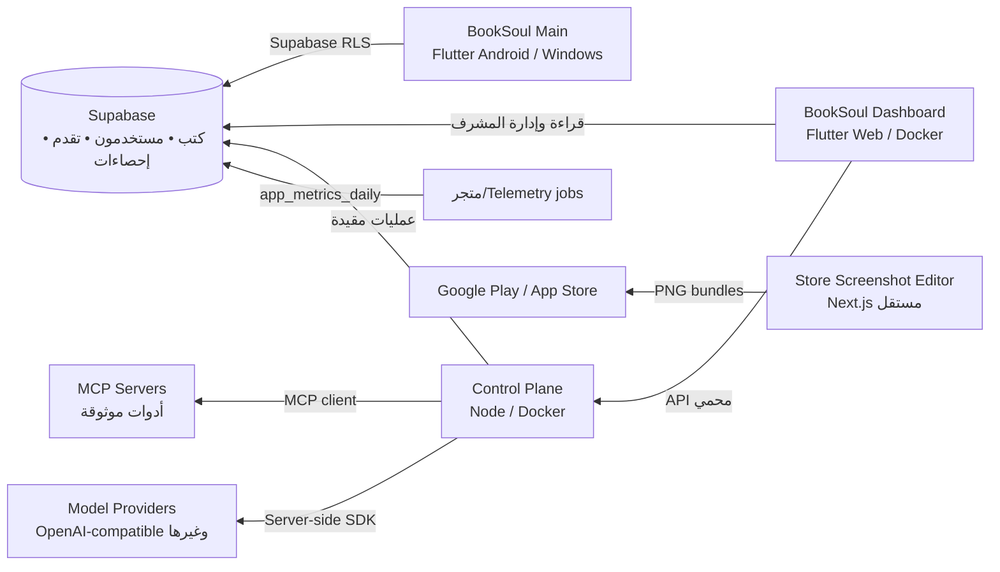

# بنية BookSoul الموحدة

يمكن دمج مشاريع إضافية حول BookSoul **كمكونات مستقلة** بدل دمجها داخل تطبيق Flutter نفسه. يبقى تطبيق القارئ خفيفًا، وتصبح لوحة Dashboard واجهة المشرف، بينما تتولى خدمة التحكم عمليات API والوكيل والتكاملات السرية من جانب الخادم.

## حدود الصلاحيات

| المكوّن | ما يسمح له | ما لا يجب أن يحمله |
|---|---|---|
| تطبيق القارئ | القراءة، حساب المستخدم، التقدم، التقييمات | مفاتيح خدمة Supabase أو مفاتيح نماذج |
| Dashboard Web | واجهة المشرف وبيانات مصرح بها عبر RLS | Service Role Key أو مفاتيح MCP أو مزودي النماذج |
| Control Plane | تكاملات خادم، API testing المسموح، وكيل خطة/تنفيذ مقيد | واجهة عامة دون مصادقة أو أوامر نصية تنفيذية غير مدققة |
| Supabase | المصدر الأساسي للبيانات والصلاحيات والإحصاءات | منطق وكيل مميز أو أسرار مزودي خارجية |
| محرر لقطات المتجر | أصول تسويقية قابلة للتعقب في Git | runtime التطبيق أو بيانات المستخدمين |

## توسيع آمن

ابدأ بوضع الوكيل الحالي الذي يولّد خطة فقط. قبل تفعيل التنفيذ، أضف هوية المشرف، صلاحيات أداة دقيقة، سجل أحداث، موافقة لكل عملية حساسة، وقائمة سماح للـ API. لا تسمح باختبارات URL حرة في خدمة التحكم؛ استخدام targets ثابتة يحمي من SSRF.

## مستودع app-store-screenshots

المستودع المشار إليه مناسب كمشروع فرعي تحت `marketing/store-screenshots/` لإنتاج لقطات Google Play وApp Store من لقطات فعلية للتطبيق. لأنه محرر Next.js منفصل ومرخص MIT، فإن دمجه في دورة الأصول التسويقية مناسب؛ لكنه لا ينبغي أن يكون تبعية runtime لتطبيق Flutter أو Dashboard.
